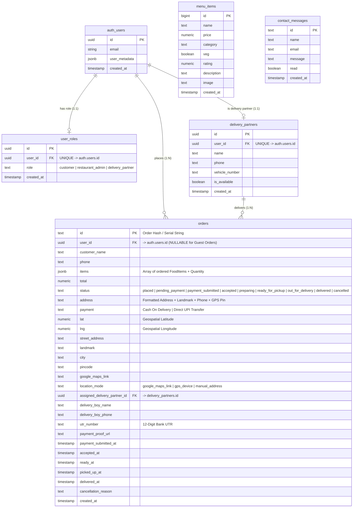

# MANAS Restaurant & Resort — Database Context & Architecture Reference

> **For AI Assistants & Developers**: This document contains the complete, authoritative database schema, table definitions, relationships, Row Level Security (RLS) policies, and expansion guidelines for the **MANAS** Food Delivery & Resort Web Application. Use this document as context when designing new features, adding tables, or refactoring backend logic.

---

## 📐 1. System Overview & Technology Stack

- **Database System**: Supabase (PostgreSQL 15+)
- **Realtime Layer**: Supabase Realtime WebSocket Channels (`supabase_realtime`)
- **Authentication**: Supabase Auth (`auth.users`) + Custom Role-Based Access Control (`user_roles`)
- **Security Posture**: Row Level Security (RLS) Enabled on 100% of tables with Least Privilege Defaults
- **Storage**: JSONB for flexible cart items + Text/Numeric for geospatial pins & transaction UTRs

---

## 🔗 2. Entity-Relationship Diagram (ERD)



---

## 🗄️ 3. Detailed Table Specifications

### A. `public.user_roles` (Role-Based Access Control)
*Connects `auth.users` to application roles (`customer`, `restaurant_admin`, `delivery_partner`).*

| Column Name | Data Type | Constraints | Description |
| :--- | :--- | :--- | :--- |
| `id` | `UUID` | `PRIMARY KEY`, `DEFAULT gen_random_uuid()` | Unique record ID |
| `user_id` | `UUID` | `NOT NULL`, `UNIQUE`, `REFERENCES auth.users(id) ON DELETE CASCADE` | FK to Supabase Auth User |
| `role` | `TEXT` | `NOT NULL`, `CHECK (role IN ('customer', 'restaurant_admin', 'delivery_partner'))` | App role |
| `created_at` | `TIMESTAMPTZ` | `DEFAULT NOW()` | Registration timestamp |

---

### B. `public.delivery_partners` (Fleet Drivers Profile)
*Stores delivery driver details and real-time availability toggle.*

| Column Name | Data Type | Constraints | Description |
| :--- | :--- | :--- | :--- |
| `id` | `UUID` | `PRIMARY KEY`, `DEFAULT gen_random_uuid()` | Unique delivery partner ID |
| `user_id` | `UUID` | `NOT NULL`, `UNIQUE`, `REFERENCES auth.users(id) ON DELETE CASCADE` | FK to Supabase Auth User |
| `name` | `TEXT` | `NOT NULL` | Full Name of driver |
| `phone` | `TEXT` | `NULLABLE` | Contact phone number |
| `vehicle_number` | `TEXT` | `NULLABLE` | License plate (e.g., RJ27 AB 1234) |
| `is_available` | `BOOLEAN` | `DEFAULT TRUE` | Realtime availability toggle |
| `created_at` | `TIMESTAMPTZ` | `DEFAULT NOW()` | Record creation timestamp |

---

### C. `public.menu_items` (Food Catalog)
*Stores dishes, prices, categories, and image URLs.*

| Column Name | Data Type | Constraints | Description |
| :--- | :--- | :--- | :--- |
| `id` | `BIGINT` | `PRIMARY KEY`, `GENERATED ALWAYS AS IDENTITY` | Unique dish ID |
| `name` | `TEXT` | `NOT NULL` | Dish name |
| `price` | `NUMERIC` | `NOT NULL`, `CHECK (price >= 0)` | Price in INR (₹) |
| `category` | `TEXT` | `NOT NULL` | Main Course, Starters, Beverages, Desserts, etc. |
| `veg` | `BOOLEAN` | `DEFAULT TRUE` | 100% Pure Veg badge flag |
| `rating` | `NUMERIC` | `DEFAULT 4.5` | Customer rating (1.0 to 5.0) |
| `description` | `TEXT` | `NULLABLE` | Dish description & ingredients |
| `image` | `TEXT` | `NOT NULL` | HD Image URL (CDN / Pexels / Unsplash) |
| `created_at` | `TIMESTAMPTZ` | `DEFAULT NOW()` | Added timestamp |

---

### D. `public.orders` (Order Lifecycle & Realtime Pipeline)
*Core table managing orders, payment proof UTRs, delivery assignment, and GPS tracking.*

| Column Name | Data Type | Constraints | Description |
| :--- | :--- | :--- | :--- |
| `id` | `TEXT` | `PRIMARY KEY` | Order ID (e.g. "84920481") |
| `user_id` | `UUID` | `NULLABLE`, `REFERENCES auth.users(id) ON DELETE SET NULL` | FK to customer (Null for Guests) |
| `customer_name` | `TEXT` | `NOT NULL` | Customer Name |
| `phone` | `TEXT` | `NOT NULL` | 10-Digit Contact Phone |
| `items` | `JSONB` | `NOT NULL` | Array of items: `[{id, name, price, qty, image}]` |
| `total` | `NUMERIC` | `NOT NULL` | Grand total in INR (₹) |
| `status` | `TEXT` | `DEFAULT 'placed'` | Status: `placed`, `pending_payment`, `payment_submitted`, `accepted`, `preparing`, `ready_for_pickup`, `out_for_delivery`, `delivered`, `cancelled` |
| `address` | `TEXT` | `NOT NULL` | Full formatted delivery address string |
| `payment` | `TEXT` | `NOT NULL` | `Cash On Delivery` or `Direct UPI Transfer` |
| `lat` | `NUMERIC` | `NULLABLE` | Latitude coordinate |
| `lng` | `NUMERIC` | `NULLABLE` | Longitude coordinate |
| `street_address` | `TEXT` | `NULLABLE` | Street / House No. |
| `landmark` | `TEXT` | `NULLABLE` | Nearby Landmark |
| `city` | `TEXT` | `DEFAULT 'Udaipur'` | City |
| `pincode` | `TEXT` | `DEFAULT '313001'` | 6-digit Pincode |
| `google_maps_link` | `TEXT` | `NULLABLE` | Shared Google Maps link |
| `location_mode` | `TEXT` | `NULLABLE` | `google_maps_link` \| `gps_device` \| `manual_address` |
| `assigned_delivery_partner_id` | `UUID` | `NULLABLE`, `REFERENCES public.delivery_partners(id)` | Assigned driver FK |
| `delivery_boy_name` | `TEXT` | `NULLABLE` | Driver Name cached |
| `delivery_boy_phone` | `TEXT` | `NULLABLE` | Driver Phone cached |
| `utr_number` | `TEXT` | `NULLABLE` | 12-digit UPI transaction reference |
| `payment_proof_url` | `TEXT` | `NULLABLE` | Uploaded payment screenshot |
| `payment_submitted_at` | `TIMESTAMPTZ` | `NULLABLE` | Payment proof submission time |
| `accepted_at` | `TIMESTAMPTZ` | `NULLABLE` | Admin acceptance timestamp |
| `ready_at` | `TIMESTAMPTZ` | `NULLABLE` | Kitchen ready timestamp |
| `picked_up_at` | `TIMESTAMPTZ` | `NULLABLE` | Driver pickup timestamp |
| `delivered_at` | `TIMESTAMPTZ` | `NULLABLE` | Order delivered timestamp |
| `cancellation_reason` | `TEXT` | `NULLABLE` | Reason if order is cancelled |
| `created_at` | `TIMESTAMPTZ` | `DEFAULT NOW()` | Order placement time |

---

### E. `public.contact_messages` (Customer Feedback)

| Column Name | Data Type | Constraints | Description |
| :--- | :--- | :--- | :--- |
| `id` | `TEXT` | `PRIMARY KEY` | Message ID |
| `name` | `TEXT` | `NOT NULL` | Sender Name |
| `email` | `TEXT` | `NOT NULL` | Sender Email |
| `message` | `TEXT` | `NOT NULL` | Message body |
| `read` | `BOOLEAN` | `DEFAULT FALSE` | Admin read status |
| `created_at` | `TIMESTAMPTZ` | `DEFAULT NOW()` | Submitted timestamp |

---

## ⚡ 4. Stored Procedures & Functions

### 1. `get_user_role(p_user_id UUID)`
Returns user role string (`restaurant_admin`, `delivery_partner`, or `customer`).
```sql
CREATE OR REPLACE FUNCTION public.get_user_role(p_user_id UUID)
RETURNS TEXT AS $$
DECLARE
  v_role TEXT;
BEGIN
  SELECT role INTO v_role FROM public.user_roles WHERE user_id = p_user_id LIMIT 1;
  RETURN COALESCE(v_role, 'customer');
END;
$$ LANGUAGE plpgsql SECURITY DEFINER;
```

### 2. `handle_new_user_role()` (Trigger)
Automatically assigns `'customer'` role on new user registration in `auth.users`.
```sql
CREATE OR REPLACE FUNCTION public.handle_new_user_role()
RETURNS TRIGGER AS $$
BEGIN
  INSERT INTO public.user_roles (user_id, role)
  VALUES (NEW.id, 'customer')
  ON CONFLICT (user_id) DO NOTHING;
  RETURN NEW;
END;
$$ LANGUAGE plpgsql SECURITY DEFINER;
```

---

## 🛡️ 5. Row Level Security (RLS) Policy Matrix

| Table Name | Operation | Policy Name | Access Condition (`USING` / `WITH CHECK`) |
| :--- | :--- | :--- | :--- |
| **`menu_items`** | `SELECT` | `Everyone can read menu items` | `true` (Public Read) |
| **`menu_items`** | `ALL` | `Admins manage menu items` | `get_user_role(auth.uid()) = 'restaurant_admin'` |
| **`orders`** | `SELECT` | `Customers view own orders` | `user_id = auth.uid() OR get_user_role(auth.uid()) = 'restaurant_admin'` |
| **`orders`** | `INSERT` | `Customers insert orders` | `auth.uid() = user_id OR user_id IS NULL` |
| **`orders`** | `ALL` | `Admins manage all orders` | `get_user_role(auth.uid()) = 'restaurant_admin'` |
| **`orders`** | `SELECT/UPDATE` | `Delivery partners view/update assigned orders` | `assigned_delivery_partner_id IN (SELECT id FROM delivery_partners WHERE user_id = auth.uid())` |
| **`user_roles`** | `SELECT` | `Users view own role` | `auth.uid() = user_id OR get_user_role(auth.uid()) = 'restaurant_admin'` |
| **`user_roles`** | `ALL` | `Admins manage roles` | `get_user_role(auth.uid()) = 'restaurant_admin'` |
| **`delivery_partners`** | `SELECT/UPDATE` | `Delivery partners manage own profile` | `user_id = auth.uid() OR get_user_role(auth.uid()) = 'restaurant_admin'` |
| **`contact_messages`** | `INSERT` | `Everyone can insert contact messages` | `true` |
| **`contact_messages`** | `ALL` | `Admins manage contact messages` | `get_user_role(auth.uid()) = 'restaurant_admin'` |

---

## 💡 6. Expansion Guidelines for New Features (For AI Prompts)

When asking an AI to add new features to this codebase, refer to these recommended schema extension patterns:

### Feature A: Table Reservation & Booking System
```sql
CREATE TABLE public.table_bookings (
  id UUID PRIMARY KEY DEFAULT gen_random_uuid(),
  user_id UUID REFERENCES auth.users(id),
  guest_name TEXT NOT NULL,
  phone TEXT NOT NULL,
  guests_count INT NOT NULL CHECK (guests_count > 0),
  booking_date DATE NOT NULL,
  booking_time TIME NOT NULL,
  special_requests TEXT,
  status TEXT DEFAULT 'confirmed' CHECK (status IN ('confirmed', 'seated', 'completed', 'cancelled')),
  created_at TIMESTAMPTZ DEFAULT NOW()
);
```

### Feature B: Customer Reviews & Ratings
```sql
CREATE TABLE public.reviews (
  id UUID PRIMARY KEY DEFAULT gen_random_uuid(),
  user_id UUID NOT NULL REFERENCES auth.users(id) ON DELETE CASCADE,
  order_id TEXT REFERENCES public.orders(id) ON DELETE CASCADE,
  rating INT NOT NULL CHECK (rating BETWEEN 1 AND 5),
  comment TEXT,
  created_at TIMESTAMPTZ DEFAULT NOW()
);
```

### Feature C: Coupons & Discount Vouchers
```sql
CREATE TABLE public.coupons (
  id UUID PRIMARY KEY DEFAULT gen_random_uuid(),
  code TEXT UNIQUE NOT NULL,
  discount_percentage NUMERIC CHECK (discount_percentage BETWEEN 1 AND 100),
  max_discount_amount NUMERIC,
  min_order_amount NUMERIC DEFAULT 0,
  valid_until TIMESTAMPTZ,
  is_active BOOLEAN DEFAULT TRUE
);
```
